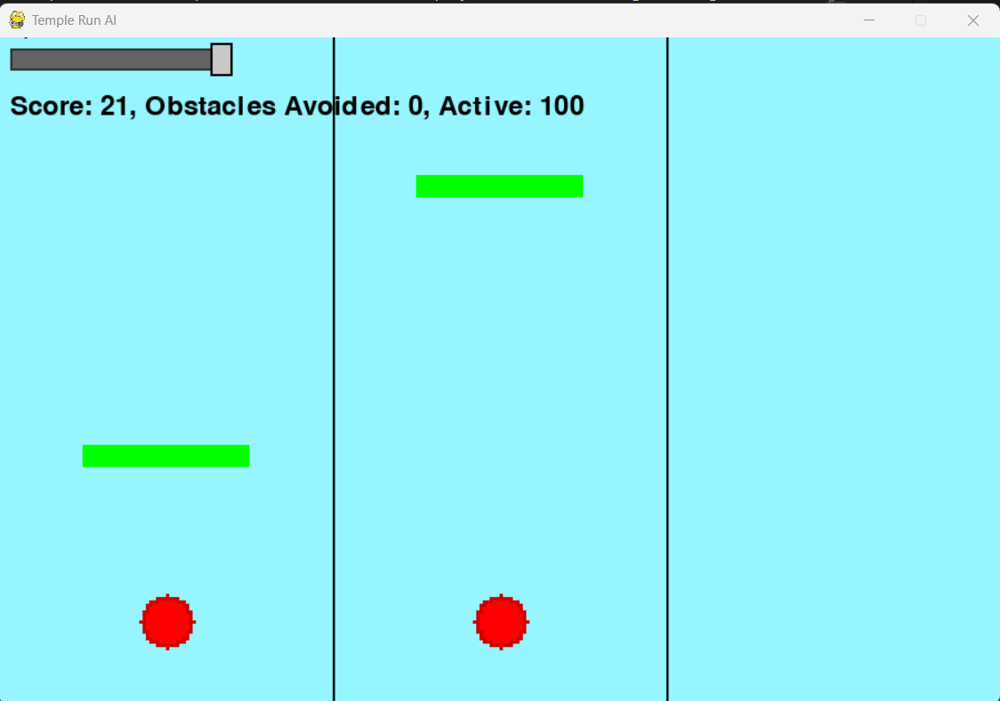
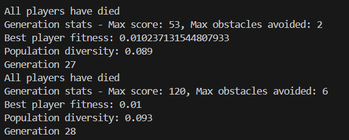
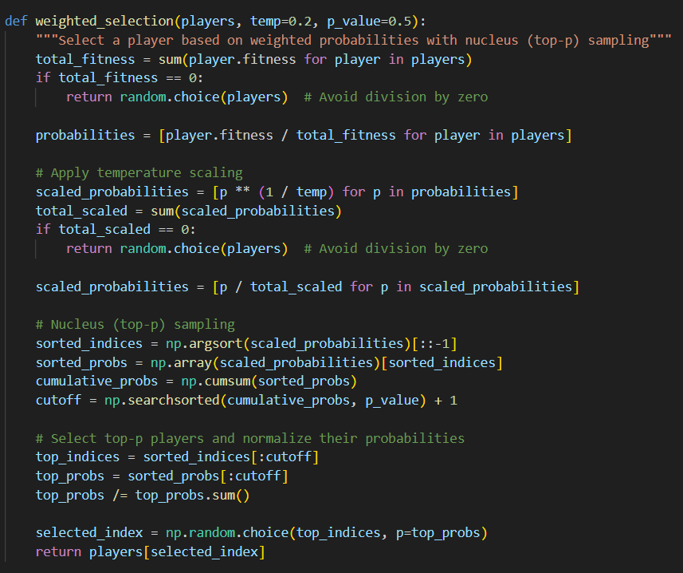
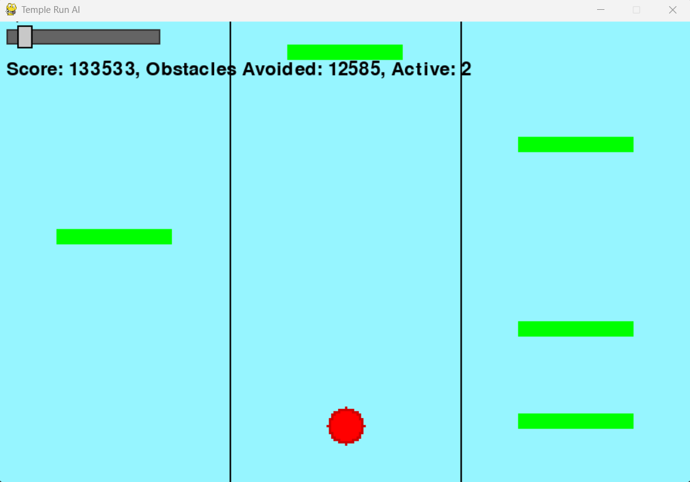

# Temple Run AI - Neuroevolution Game Agent

A sophisticated AI implementation that learns to play an endless runner game using neuroevolution and genetic algorithms. The project demonstrates advanced machine learning concepts including neural network optimization, population-based learning, and real-time game AI.

## Project Overview

This project implements an AI agent capable of learning to navigate a Temple Run-style endless runner game through evolutionary computation. Unlike traditional deep learning approaches, this system uses neuroevolution to evolve neural network weights through genetic algorithms, creating agents that improve over successive generations.

### Key Features

- **Neuroevolutionary Neural Networks**: Custom-built neural networks evolved through genetic algorithms

*Terminal output of training the model*


- **Population-Based Learning**: Simultaneous training of 1000 AI agents per generation
- **Adaptive Genetic Algorithms**: Dynamic mutation rates and advanced selection mechanisms
- **Real-Time Visualization**: Live gameplay with performance metrics and speed controls
- **Sophisticated Fitness Functions**: Multi-objective optimization balancing survival, score, and movement efficiency

## Technical Architecture

### Neural Network Design

The AI brain is implemented as a fully connected neural network with:
- **Input Layer**: 8 neurons processing game state information
- **Hidden Layer**: 8 neurons with tanh activation functions
- **Output Layer**: 3 neurons corresponding to game actions (left, stay, right)

```python
# Network Architecture
Input: [player_position_one_hot(3), obstacle_lane(1), obstacle_distance(1), 
        current_lane_safety(1), left_lane_safety(1), right_lane_safety(1)]
Hidden: 8 neurons (tanh activation)
Output: 3 neurons (argmax for action selection)
```

### Genetic Algorithm Implementation

#### Advanced Selection Mechanisms
- **Nucleus (Top-p) Sampling**: Probabilistic selection focusing on top-performing individuals
- **Temperature Scaling**: Adjustable exploration vs exploitation balance
- **Weighted Selection**: Fitness-proportionate selection with adaptive parameters

#### Adaptive Mutation Strategy
```python
adaptive_rate = base_mutation_rate * (2.0 - population_diversity)
mutation_strength = 0.1 if diversity > 0.5 else 0.3
```

#### Dynamic Elite Preservation
- Adaptive elite percentage based on population diversity
- Elite count varies from 20% to 40% based on genetic diversity metrics

### Game State Representation

The AI processes a sophisticated state representation including:
1. **Positional Encoding**: One-hot representation of current lane position
2. **Obstacle Intelligence**: Distance and lane information for immediate threats
3. **Safety Analysis**: Forward-looking safety scores for all lanes
4. **Predictive Modeling**: Multi-step ahead obstacle avoidance calculations

## Technical Challenges and Solutions

### Challenge 1: Population Diversity Management
**Problem**: Genetic algorithms can suffer from premature convergence, where the population becomes too similar and loses diversity.

**Solution**: Implemented adaptive diversity monitoring with dynamic mutation rates:
```python
# Advanced diversity calculation with sampling optimization
def calculate_population_diversity(players):
    # Samples subset for performance, calculates genetic distance
    sample_size = min(50, len(players))
    sampled_players = random.sample(players, sample_size)
    total_distance = 0
    for genome_pair in sampled_combinations:
        distance = np.mean(np.abs(genome1 - genome2))
        total_distance += distance
    return normalized_diversity_score
```

### Challenge 2: Fitness Function Optimization
**Problem**: Balancing multiple objectives (survival time, obstacles avoided, movement efficiency) without causing optimization conflicts.

**Solution**: Developed a composite fitness function with movement efficiency bonuses:
```python
# Composite fitness with movement efficiency
score_component = (player.score / max_score) * 0.8
move_efficiency = min(1.0, obstacles_avoided / moves_made) if moves_made > 0 else 0.1
efficiency_bonus = move_efficiency * 0.2
player.fitness = (score_component + efficiency_bonus) ** 2
```

### Challenge 3: Real-Time Performance Optimization
**Problem**: Maintaining 60+ FPS while simulating 1000 AI agents simultaneously.

**Solutions Implemented**:
- **Vectorized Operations**: NumPy-based batch processing for neural network computations
- **Optimized Collision Detection**: Pygame rect-based collision system with efficient object lifecycle management
- **Memory Management**: Efficient obstacle lifecycle management with single-pass updates and obstacle tracking flags
- **Selective Rendering**: Only render the best-performing agent to reduce overhead
- **Dynamic Speed Control**: Interactive speed slider allowing real-time FPS adjustment from 10-600 FPS
- **Smart Obstacle Counting**: Implemented flag-based tracking to prevent double-counting of passed obstacles

### Challenge 4: Neural Network Stability
**Problem**: Preventing gradient explosion and ensuring numerical stability in evolution.

**Solution**: Multiple stability mechanisms:
```python
# Numerical clipping in activation functions
def tanh(self, x):
    return np.tanh(np.clip(x, -500, 500))

# Weight clamping during mutation
genome[i] = np.clip(genome[i], -2.0, 2.0)
```

### Challenge 5: Dynamic Difficulty Scaling
**Problem**: Maintaining engaging gameplay across different skill levels and generations.

**Solution**: Implemented progressive difficulty system:
```python
# Dynamic difficulty based on player performance
DIFFICULTY_LEVELS = [
    {"threshold": 0, "speed": 5, "multiplier": 1, "spawn_mod": 3},
    {"threshold": 100, "speed": 8, "multiplier": 1.5, "spawn_mod": 5},
    {"threshold": 200, "speed": 10, "multiplier": 2, "spawn_mod": 8},
    {"threshold": 400, "speed": 15, "multiplier": 2.5, "spawn_mod": 10},
    {"threshold": 800, "speed": 20, "multiplier": 3, "spawn_mod": 15}
]
```

### Challenge 6: Obstacle Management Efficiency
**Problem**: Accurately tracking obstacles passed by multiple agents without performance degradation or double-counting.

**Solution**: Implemented flag-based obstacle tracking system:
```python
# Efficient obstacle counting with tracking flags
for obstacle in game_state.obstacles:
    if (obstacle['y'] > constants.PLAYER_Y + constants.PLAYER_HEIGHT and 
        not obstacle.get('counted', False)):
        player.obstacle_avoided += 1
        obstacle['counted'] = True
```

## Strong Technical Points

### 1. Advanced Genetic Algorithm Design
- **Nucleus Sampling**: Implementation of cutting-edge selection mechanisms from natural language processing

- **Adaptive Parameters**: Dynamic adjustment of mutation rates based on population metrics with diversity-based elite preservation (20%-40% elite retention)
- **Multi-Objective Optimization**: Sophisticated fitness landscapes balancing survival time, obstacle avoidance, and movement efficiency

### 2. Efficient Neural Network Implementation
- **Custom Implementation**: Built from scratch without external ML libraries
- **Optimized Forward Pass**: Vectorized operations for population-scale inference
- **Genome Serialization**: Efficient conversion between network weights and genetic representation

### 3. Real-Time Performance Engineering
- **Concurrent Agent Simulation**: Handling 1000 agents at 60+ FPS with dynamic speed control
- **Memory-Efficient Design**: Minimal allocation during gameplay loops with optimized obstacle management and flag-based tracking
- **Modular Architecture**: Clean separation of concerns for maintainability with dedicated state management

### 4. Sophisticated Game AI
- **Predictive State Representation**: Forward-looking obstacle analysis with 300-pixel lookahead range
- **Lane Safety Calculations**: Dynamic safety scoring for decision making with continuous threat assessment
- **Behavioral Emergence**: Complex behaviors emerging from simple rule sets with fitness-based color coding
- **Pixelated Visualization**: Advanced player rendering with fitness-based visual feedback

## Performance Metrics

### Learning Progression
- **Generation 0**: Random behavior, average survival ~50 frames
- **Generation 5-10**: Basic obstacle avoidance emerges
- **Generation 15+**: Advanced strategies, survival 500+ frames
- **Convergence**: Stable high-performance behavior by generation 20-30


## 🛠 Technical Stack

- **Core Language**: Python 3.8+
- **Graphics**: Pygame for real-time rendering
- **Numerical Computing**: NumPy for vectorized operations
- **Architecture**: Object-oriented design with modular components

## Installation and Usage

```bash
# Clone the repository
git clone https://github.com/AbemKW/Temple-Run-AI.git
cd Temple-Run-AI

# Install dependencies
pip install pygame numpy

# Run the simulation
python main_game.py
```

### Project Structure
```
Temple-Run-AI/
├── main_game.py          # Main game loop and UI management
├── player.py             # Player class with AI brain integration  
├── model.py              # Neural network implementation
├── generation.py         # Genetic algorithm and evolution logic
├── game_state.py         # Game state management and collision detection
├── render_state.py       # Rendering utilities
├── constants.py          # Game configuration and parameters
├── README.md             # Project documentation
└── Images/               # Screenshots and documentation images
```

### Controls
- **Speed Slider**: Adjust simulation speed (10-600 FPS) with real-time interactive control
- **Real-time Metrics**: Live population statistics and performance data including active agent count, score, and obstacles avoided

## Research Applications

This project demonstrates several advanced AI concepts applicable to:
- **Evolutionary Computation Research**: Novel selection and mutation strategies
- **Game AI Development**: Real-time decision making under uncertainty
- **Neural Architecture Search**: Automated network optimization
- **Multi-Agent Systems**: Population-based learning dynamics

## Future Enhancements

- **Speciation Algorithms**: Implementing NEAT-style species protection
- **Hierarchical Networks**: Multi-level decision architectures
- **Transfer Learning**: Cross-environment skill transfer
- **Parallel Evolution**: GPU-accelerated population simulation

## Key Learnings

1. **Population diversity is crucial** for avoiding local optima in evolutionary algorithms - implemented adaptive elite preservation (20%-40%)
2. **Composite fitness functions** require careful balancing to prevent conflicting objectives - movement efficiency bonuses prevent stagnant behavior
3. **Real-time constraints** demand significant optimization even for "simple" neural networks - achieved 1000 agents at 60+ FPS
4. **Emergent behavior** in neuroevolution can produce surprisingly sophisticated strategies with minimal rule sets
5. **Interactive visualization** greatly enhances understanding of AI learning dynamics - speed slider enables real-time observation
6. **Modular architecture** is essential for maintaining and extending complex AI systems

---

*This project showcases the power of evolutionary computation in creating intelligent game agents, demonstrating that complex behaviors can emerge from simple rules when guided by well-designed selection pressures.*